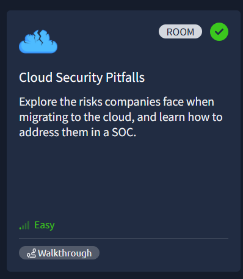
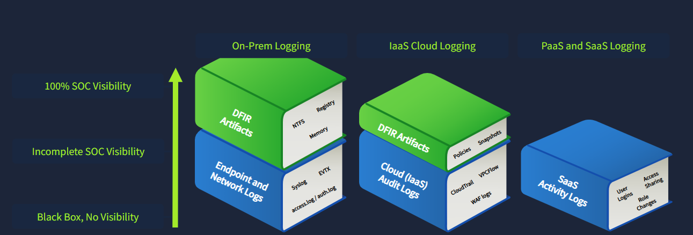

# ☁️ Cloud Security Pitfalls

A practical cybersecurity project based on the **Cloud Security Pitfalls** room on TryHackMe.

This project explores common security risks introduced during cloud migration, differences between **IaaS, PaaS, and SaaS**, cloud logging challenges, and approaches to security monitoring and SOC coverage.

## 🎯 Objectives

* Understand the security differences between IaaS, PaaS, and SaaS.
* Identify common cloud migration security pitfalls.
* Understand the **shared responsibility** concept in cloud security.
* Explore challenges in collecting and integrating cloud logs with SIEM.
* Identify key areas that should be monitored in cloud environments.
* Understand common cloud security solutions such as CASB, CWPP, and CSPM.

## 🔐 Key Security Concepts

### Cloud Service Models

| Model    | Security Focus                                                      |
| -------- | ------------------------------------------------------------------- |
| **IaaS** | Workloads, cloud services, and control plane                        |
| **PaaS** | Application and platform security                                   |
| **SaaS** | Provider-managed application with customer access and data controls |

### Cloud Monitoring

Cloud environments require monitoring across different layers:

* **Workloads** — VMs and containers
* **Cloud Services** — databases, storage, and other services
* **Control Plane** — cloud administrative accounts and actions

Cloud logging can also present challenges, including:

* Paid log collection or additional licensing
* Incomplete or poorly structured log formats
* Limited SIEM integration

## 🛡️ Cloud Security Tools

| Tool     | Purpose                                                    |
| -------- | ---------------------------------------------------------- |
| **CASB** | Enforces security policies for cloud applications          |
| **CWPP** | Protects cloud workloads such as containers and VMs        |
| **CSPM** | Detects and helps address cloud security misconfigurations |

Examples of workload security tools include **Falco** and **Tetragon**.

## ⚠️ Cloud Migration Risks

Moving systems to the cloud does not automatically make them secure.

Common risks include:

* Unpatched systems
* Weak passwords or missing MFA
* Exposed API keys
* Stolen session cookies
* Misconfigured cloud resources
* Insufficient logging and monitoring
* Third-party and supply-chain risks

A key lesson from the room is that cloud environments require security practices specifically designed for cloud infrastructure rather than simply copying traditional on-premises security controls.

## 📊 Monitoring Approach

A basic cloud monitoring strategy should include:

1. Identify all cloud platforms used by the organization.
2. Understand potential cloud and vendor risks.
3. Enable available cloud audit logs.
4. Enable workload logging for IaaS environments.
5. Forward relevant logs to a SIEM.
6. Create detections for suspicious logins and administrative actions.

## 📸 Project Evidence

### Cloud Monitoring & Security Tools

### TryHackMe Completion

Completed the **Cloud Security Pitfalls** room on TryHackMe.

## 🧪 Platform & Training

* **Platform:** TryHackMe
* **Room:** Cloud Security Pitfalls
* **Level:** Easy
* **Focus:** Cloud Security, SOC Monitoring, Cloud Logging, Shared Responsibility

## 🧠 Key Takeaways

This project provided practical exposure to cloud security concepts and the challenges SOC teams face when monitoring cloud environments. It reinforced the importance of cloud-specific security controls, centralized logging, workload monitoring, and continuous detection of suspicious activity.

---

**Author:** Farah Samer Soufan
**GitHub:** [FarahSamer-eng](https://github.com/FarahSamer-eng)
